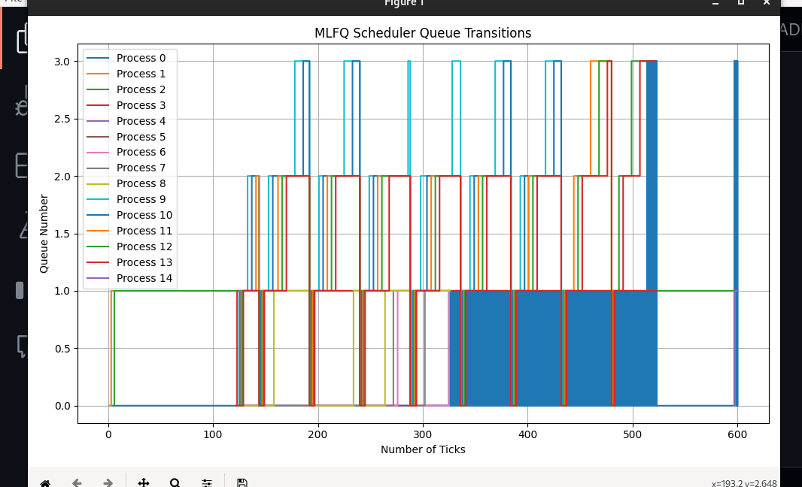

# Mini Project 2 Report

## System Calls
---
### 1. Gotta Count '

**Implementation Details:**
- Implemented `getSysCount` in the `sysproc.c` file. This function maintains a counter for each system call and increments it each time the specified syscall is called.
- added sys_getSysCount in syscall array

- The input mask (e.g., `1 << i`) is parsed to identify the syscall of interest. This was achieved using bitwise operations to determine which bit is set in the mask.

  - I have declared a golbal array i.e syscall_count of size 32 in syscall.c to store the count of syscall

  - To count syscalls made by child processes, I modified the logic to traverse the process table, summing counts from both the parent and its children.

- created a syscount.c file in user and ,I have use a array which maps system call indices to their names, enabling the program to display the corresponding syscall name based on the provided mask.

- The parent process waits for the child to finish. After that, it retrieves the count of the specified system calls using getSysCount(mask) and determines which syscall was counted based on the bitmask.

### 2. Wake Me Up When My Timer Ends

**Implementation Details:**

- **System Call Creation:**
 include some book keeping in structure of proc like
  - int alarm_interval-- Interval in ticks for the alarm
  - uint64 alarm_handler- Address of the alarm handler
  - int alarm_last_triggered-- Last tick when alarm was triggered
  - int in_alarm_handler; -Flag to indicate if in alarm handler
  - struct trapframe \*alarm_tf-- Trapframe to save the state before the alarm handler
  - void (*alarm_handler)(); // Alarm handler function

  - Implemented `sigalarm(interval, handler)` in `sysproc.c`. This call sets a timer that triggers the specified handler after a given number of CPU ticks.
  - I have done some changes in trap.c
    it checks if an alarm should trigger. If the current time (ticks) exceeds the last triggered time by the interval, it prepares to call the alarm handler. This allows processes to perform periodic tasks or wake-up events, which is crucial for applications needing timers.

  - When the timer expires, the kernel invokes the handler function. I maintained the process state using a structure to save the context before the handler is called and restore it afterward using `sigreturn()`.also sigreturn is implemented in `sysproc.c`
  - I have also create  a file alarm.c to test it in my way
  
---

## Scheduling Policies

### 3. The Process Powerball 

**Specification:**

Implemented a lottery-based scheduling policy where processes are assigned CPU time slices based on the number of tickets they hold.

  - Created a system call `settickets(int number)` to allow processes to adjust their number of tickets. Each process starts with one ticket, and the function adjusts this value.
  - in proc.h added ticket to struct of proc and also in allocproc  funtion set it to 1

- **Random Ticket Selection:**

  - Implemented a random number generator  using a simple algorithm to select a winning process based on its tickets in proc.c . If multiple processes have the same number of tickets, the one that arrived first wins.

- **Process Initialization:**
  - Each process is assigned its ticket count upon creation, and children inherit their parent's ticket count.

---

## Analysis of Lottery Scheduling and answer of the quesions asked 

# 1 -
- Adding arrival time in lottery scheduling involves considering the   time a process has been waiting when distributing chances (tickets) for CPU time. This ensures that processes waiting longer have a higher probability of getting CPU time, which can improve fairness and responsiveness.
- Example:
- Consider three processes:
   - Process A: 5 tickets, arrives at time 0
   - Process B: 5 tickets, arrives at time 2
   - Process C: 5 tickets, arrives at time 4
- Without arrival time consideration, each process has an equal probability of being selected. With arrival time considered, Process A, having waited the longest, would get a higher probability of execution, ensuring that older processes get a chance to run.

# 2 -

#    ## Pitfalls to Watch Out For  ##
 -   Increased Complexity: Incorporating arrival time increases the complexity of the scheduling algorithm as it needs to keep track of and update the weights based on the waiting time.
    Potential Starvation: If not carefully implemented, newer processes might suffer starvation if older processes keep getting higher weights and therefore higher chances of being scheduled.
# 3-
Consider four processes:
    Process A: 10 tickets, arrives at time 0
    Process B: 10 tickets, arrives at time 1
    Process C: 10 tickets, arrives at time 2
    Process D: 10 tickets, arrives at time 3
With each process having an equal number of tickets, each has a 25% chance of being selected. Over multiple scheduling cycles, if the randomness favors certain processes, others might get significantly less CPU time, leading to unfair execution.    

---

# MLFQ analysis

### Queue Structure

The scheduler employs four priority queues, each assigned different time slices. Processes are organized based on their current priority, which adjusts dynamically according to their behavior during execution.

- **Queue Levels**:

  - **Queue 0**: Highest priority (shortest time slice)

  - **Queue 1**: Medium-high priority

  - **Queue 2**: Medium-low priority

  - **Queue 3**: Lowest priority (longest time slice, uses Round-Robin scheduling)

### Proc Structure Modifications

The process control block (PCB) is modified to include the following fields:

- `int priority`: Current queue number of the process.

- `int runtime`: Time consumed in the current priority queue.

- `int time_slice`: Time slice allocated to the process based on its priority.

### Process Promotion and Demotion

- **Demotion**: If a process uses the complete time slice allocated for its current priority queue, it is moved to the end of the next lower-level queue.

- **Promotion**: Processes that relinquish control of the CPU voluntarily (e.g., for I/O operations) stay in the same queue and are re-inserted at the tail when they become ready again.

### Scheduling Policy

The scheduler implements the following key policies:

1. **Preemption**: If a process is running in a lower priority queue and a new process arrives in a higher priority queue, the current process is preempted and the new process is allocated the CPU.

2. **Round-Robin Scheduling**: At the lowest priority queue (Queue 3), processes are scheduled in a round-robin manner, ensuring fair time-sharing.

3. **Priority Boosting**: To prevent starvation, after a defined period (48 ticks), all processes are moved back to the highest priority queue (Queue 0). This is crucial to ensure that longer-running processes do not indefinitely starve waiting for CPU time.

### Performance Evaluation
- result while using single CPU are as follow:
- **LBS**: 

  - Average Response Time: 18

  - Average Waiting Time: 153

- **MLFQ**: 

  - Average Response Time: 18

  - Average Waiting Time: 160

- **RR (Round-Robin)**: 

  - Average Response Time: 19

  - Average Waiting Time: 176
  
## MLFQ Analysis
Below is a timeline graph showing the movement of processes between different queues over time. The graph demonstrates the effect of the priority boost and the dynamic nature of the MLFQ scheduler.

graph.png

